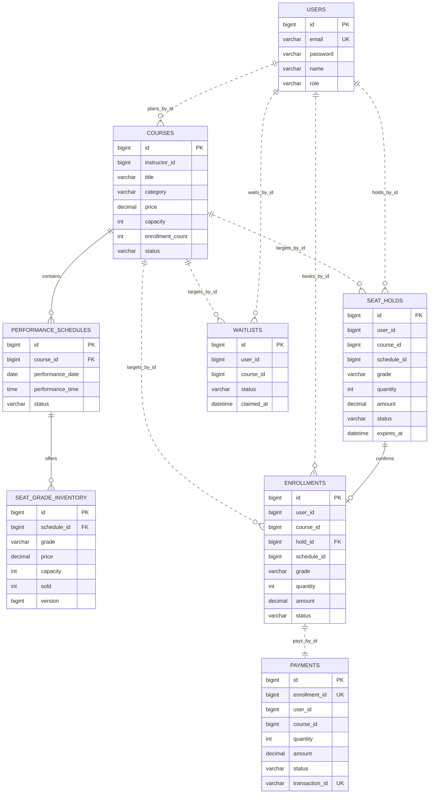

# INTicket 도메인 및 데이터 설계

## 경계와 소유권

- `user-service`만 회원·역할 데이터를 소유합니다. 비밀번호는 BCrypt 해시로 저장합니다.
- `course-service`만 공연, 회차, 좌석 등급 가격과 판매 재고를 변경합니다.
- `enrollment-service`만 선점, 예매 상태와 취소표 대기 순서를 변경합니다.
- `payment-service`만 결제 거래와 취소 상태를 변경합니다.
- `recommend-service`는 영속 DB를 소유하지 않고 예매·공연 API를 조합합니다.
- 서비스 경계를 넘는 데이터는 물리 FK 대신 ID, REST, Kafka 이벤트로 연결합니다. 같은 서비스 스키마 안에서만 FK를 둡니다.

## MariaDB 스키마

한 MariaDB 인스턴스 안에서 서비스별 논리 스키마를 분리합니다. 운영 환경에서는 같은 모델을 별도 DB 인스턴스로 이전할 수 있습니다.

### `lecture_db` — user-service / auth-server

| 테이블 | 주요 칼럼 | 용도 |
|---|---|---|
| `users` | `id`, `email` UQ, `password`, `name`, `role`, `created_at`, `updated_at` | 자체 회원·역할·인증 원천 |

### `performance_db` — course-service

| 테이블 | 주요 칼럼 | 용도 |
|---|---|---|
| `courses` | `id`, `title`, `description`, `category`, `price`, `instructor_id`, `enrollment_count`, `capacity`, `status` | 공연 카탈로그와 누적 판매 수량 |
| `performance_schedules` | `id`, `course_id` FK, `performance_date`, `performance_time`, `status` | 공연 회차 |
| `seat_grade_inventory` | `id`, `schedule_id` FK, `grade`, `price`, `capacity`, `sold`, `version` | 회차·등급별 가격과 원자적 재고 |

`seat_grade_inventory(schedule_id, grade)`는 유일하며, 재고 증감 시 행 비관적 잠금과 JPA 버전을 함께 사용합니다.

### `booking_db` — enrollment-service

| 테이블 | 주요 칼럼 | 용도 |
|---|---|---|
| `seat_holds` | `id`, `user_id`, `course_id`, `schedule_id`, `grade`, `quantity`, `unit_price`, `amount`, `status`, `expires_at` | 결제 전 10분 좌석 선점 |
| `enrollments` | `id`, `user_id`, `course_id`, `hold_id` FK/UQ, `schedule_id`, `grade`, `quantity`, `unit_price`, `amount`, `status` | 예매 원장 |
| `waitlists` | `id`, `user_id`, `course_id`, `status`, `claimed_at`, `created_at` | 취소표 FIFO 대기 및 매칭 claim |

`enrollments.active_booking_key`는 `PENDING`/`ACTIVE` 상태일 때만 `user_id:course_id`를 만드는 생성 칼럼입니다. 이 값의 유일 제약으로 취소 이력은 보존하면서 활성 중복 예매를 막습니다. `waitlists.active_waiting_key`도 같은 방식으로 `WAITING` 중복 등록만 차단합니다. 두 칼럼은 애플리케이션 엔티티가 아닌 DB 무결성 전용입니다.

### `payment_db` — payment-service

| 테이블 | 주요 칼럼 | 용도 |
|---|---|---|
| `payments` | `id`, `enrollment_id` UQ, `user_id`, `course_id`, `quantity`, `amount`, `status`, `transaction_id` UQ | 예매 단위 결제·취소 원장 |

`enrollment_id` 유일 제약으로 같은 예매의 결제 재시도를 멱등 처리합니다.

## ERD

실선은 같은 스키마의 물리 FK, 점선은 서비스 간 논리 ID 참조입니다.

## 외부 API 소유권

Gateway의 기존 라우트와 호환하기 위해 공연 API도 `/api/courses`, 예매 API도 `/api/enrollments` 접두사를 유지합니다.

| 서비스 | 주요 API |
|---|---|
| user | `POST /api/users/register`, `GET /api/users/me` |
| course | `GET/POST /api/courses`, `GET /api/courses/{id}`, `GET /api/courses/{id}/schedules`, `POST /api/courses/{id}/schedules`, `GET /api/courses/{id}/sales` |
| enrollment | `POST/DELETE /api/enrollments/holds`, `POST /api/enrollments`, `GET /api/enrollments/my`, `DELETE /api/enrollments/{id}`, `POST /api/enrollments/waitlist`, `GET /api/enrollments/waitlist/my` |
| payment | 내부 `POST /api/payments/internal/request`, `POST /api/payments/internal/cancel`; 조회 API |
| recommend | `GET /api/recommend/{userId}` |

## 일관성 규칙

- 좌석 선점은 회차·등급 행을 잠근 뒤 `sold`를 증가시키며 최대 4매로 제한합니다.
- 결제하지 않은 `HELD`는 15초 주기로 검사해 10분 만료 시 재고를 복구합니다.
- Kafka 중복 수신 시 이미 `ACTIVE`인 예매는 무시하고, 이미 `CANCELLED`인 예매는 되살리지 않습니다.
- 취소표 매칭은 가장 오래된 `WAITING` 행을 잠그고 `claimed_at`으로 선점합니다. 실패한 claim은 복구하며 비정상 종료로 남은 claim은 2분 뒤 해제합니다.
- 서비스 간 트랜잭션은 하나로 묶지 않습니다. 각 서비스가 자기 DB를 먼저 확정하고 REST/Kafka로 후속 상태를 전파하는 작은 Saga 형태입니다.
